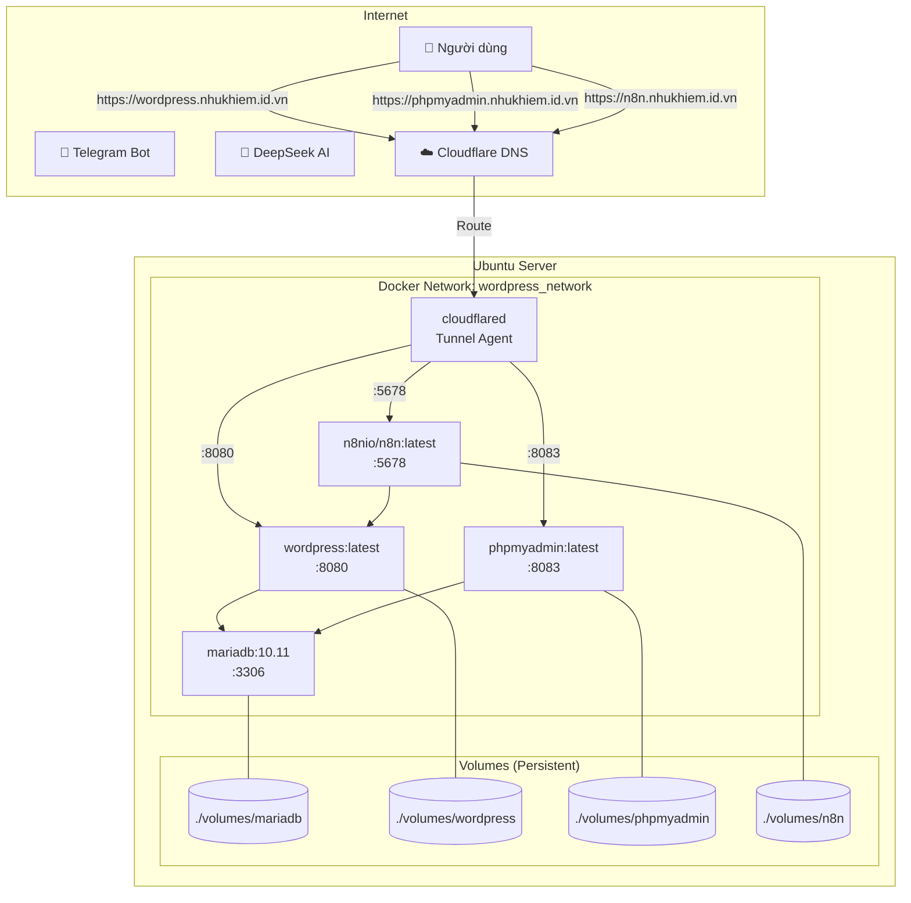
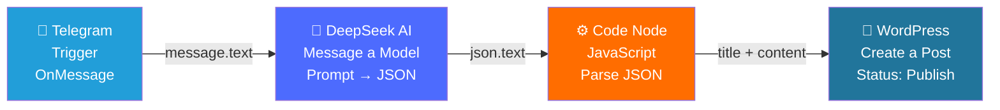
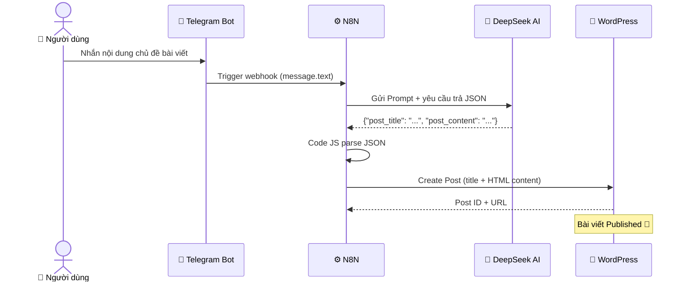
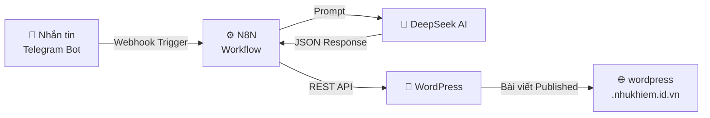

# 🚀 BT4 – Tự Động Đăng Bài WordPress Với N8N

> **Môn:** Phát triển ứng dụng với mã nguồn mở – TEE0421  
> **Lớp:** 58KTPM  
> **Sinh viên:** Như Khiêm  
> **Deadline:** 23h59 ngày 25/05/2026

[](https://wordpress.nhukhiem.id.vn)
[](https://n8n.nhukhiem.id.vn)
[](https://www.docker.com/)
[](#)
[](https://cloudflare.com)

---

## 📋 Mục Lục

- [Giới thiệu](#-giới-thiệu)
- [Kiến trúc hệ thống](#-kiến-trúc-hệ-thống)
- [Yêu cầu hệ thống](#-yêu-cầu-hệ-thống)
- [Cấu trúc thư mục](#-cấu-trúc-thư-mục)
- [Hướng dẫn triển khai](#-hướng-dẫn-triển-khai)
  - [Bước 1 – Clone & cấu hình môi trường](#bước-1--clone--cấu-hình-môi-trường)
  - [Bước 2 – Chạy Docker Compose](#bước-2--chạy-docker-compose)
  - [Bước 3 – Cấu hình Cloudflare Tunnel](#bước-3--cấu-hình-cloudflare-tunnel)
  - [Bước 4 – Cài đặt WordPress](#bước-4--cài-đặt-wordpress)
- [Cấu hình N8N](#-cấu-hình-n8n)
  - [Bước 1 – Tạo tài khoản & Activate License](#bước-1--tạo-tài-khoản--activate-license)
  - [Bước 2 – Tạo Telegram Bot](#bước-2--tạo-telegram-bot)
  - [Bước 3 – Lấy DeepSeek API Key](#bước-3--lấy-deepseek-api-key)
  - [Bước 4 – Tạo WordPress Application Password](#bước-4--tạo-wordpress-application-password)
  - [Bước 5 – Build Workflow](#bước-5--build-workflow)
- [Kết quả đạt được](#-kết-quả-đạt-được)
- [Nhận xét](#-nhận-xét)

---

## 📖 Giới Thiệu

Bài tập 4 mở rộng từ BT3 bằng cách **bổ sung service N8N** vào hệ thống Docker Compose, sau đó xây dựng một **workflow tự động hoàn chỉnh**:

> 💬 Nhắn tin với Telegram Bot → 🤖 DeepSeek AI sinh nội dung HTML → ⚙️ N8N xử lý → 📝 Bài viết tự động được đăng lên WordPress

**5 service hoạt động song song:**

| Service | Image | Vai trò |
|---|---|---|
| `mariadb` | `mariadb:latest` | Cơ sở dữ liệu |
| `phpmyadmin` | `phpmyadmin:latest` | Quản trị CSDL qua giao diện web |
| `wordpress` | `wordpress:latest` | CMS – trang web chính |
| `cloudflared` | `cloudflare/cloudflared:latest` | Tunnel public ra Internet |
| `n8n` | `n8nio/n8n:latest` | Automation workflow engine |

---

## 🏗️ Kiến Trúc Hệ Thống

### Sơ đồ hạ tầng Docker



### Sơ đồ N8N Workflow



### Luồng dữ liệu chi tiết



---

## 💻 Yêu Cầu Hệ Thống

| Thành phần | Phiên bản tối thiểu |
|---|---|
| Ubuntu | 24.04.4 LTS |
| Docker | 29.4.0 |

**Tài khoản cần có trước:**
- [x] Cloudflare account + domain đã cấu hình
- [x] Telegram account
- [x] DeepSeek account (https://platform.deepseek.com)

---

## 📁 Cấu Trúc Thư Mục

```
BT4-WordPress-N8N/
├── 📄 docker-compose.yml       # Định nghĩa 5 services
├── 📄 .env                     # Biến môi trường (không commit)
├── 📄 .env.example             # Template biến môi trường
├── 📄 .gitignore
├── 📁 volumes/                 # Dữ liệu persistent (auto tạo)
│   ├── mariadb/
│   ├── wordpress/
│   └── n8n/
└── 📄 README.md
```

---

## 🚀 Hướng Dẫn Triển Khai

### Bước 1 – Clone & Cấu Hình Môi Trường

```bash
# Clone repository
git clone https://github.com/nhukhiem3143/BT4-WordPress-Dev-App-OpenSrc.git
cd wordpress-project

# Tạo file .env từ template
cp .env.example .env
```

Mở `.env` và điền đầy đủ thông tin:

```env
# === MARIADB DATABASE ===
MYSQL_ROOT_PASSWORD=
MYSQL_DATABASE=
MYSQL_USER=
MYSQL_PASSWORD=

# === WORDPRESS ===
WORDPRESS_DB_HOST=mariadb:3306
WORDPRESS_TABLE_PREFIX=wp_

# === PORTS ===
WORDPRESS_PORT=8080
PHPMYADMIN_PORT=8083
N8N_PORT=5678

# === N8N ===
N8N_WEBHOOK_URL=

# === CLOUDFLARED TUNNEL ===
CLOUDFLARED_TUNNEL_TOKEN=

# === TIMEZONE (Optional) ===
TZ=Asia/Ho_Chi_Minh
```

> ⚠️ **Lưu ý:** Không commit file `.env` lên GitHub.

---

### Bước 2 – Chạy Docker Compose


#### Pull tất cả images
```bash
docker compose pull
```


#### Khởi chạy tất cả services ở chế độ nền
```bash
docker compose up -d
```

##### Kiểm tra trạng thái các service
```bash
docker compose ps
```

**Kết quả:**


---

### Bước 3 – Cấu Hình Cloudflare Tunnel

Truy cập **Cloudflare Dashboard → Zero Trust → Networks → Tunnels → wordpress-tunnel → Configure → Public Hostnames**

Thêm **3 router** như sau:

| Subdomain | Service | Port |
|---|---|---|
| `wordpress.nhukhiem.id.vn` | `http://wordpress:80` | *(đã có từ BT3)* |
| `phpmyadmin.nhukhiem.id.vn` | `http://phpmyadmin:80` | Thêm mới |
| `n8n.nhukhiem.id.vn` | `http://n8n:5678` | Thêm mới |

##### Thêm tunnel cho phpmyadmin


##### Thêm tunnel cho n8n


##### Kết quả 


> 💡 Tên service trong URL tunnel phải khớp với tên service trong `docker-compose.yml`.

---

## ⚙️ Cấu Hình N8N

### Bước 1 – Tạo Tài Khoản & Activate License

**Tạo tài khoản admin:**
1. Truy cập `https://n8n.nhukhiem.id.vn`
2. Điền đầy đủ thông tin: First name, Last name, **Email** (quan trọng!), Password


3. Chọn **"Send me a License key"** → điền thông tin → Submit


4. Kiểm tra email để lấy **License Key**


**Activate License:**
```
SETTING (góc dưới trái) → Usage and Plan → Enter activation key → Paste key → Activate
```


> ✅ Thông báo thành công: *"Your Registered Community Edition has been successfully activated."*


---

### Bước 2 – Tạo Telegram Bot

1. Mở Telegram → tìm kiếm **@BotFather** → bắt đầu chat
2. Gõ lệnh `/newbot`
3. Đặt tên bot (vd: `Bot_Wordpress`)
4. Đặt username bot (phải kết thúc bằng `bot`, vd: `nhukhiem_wp_bot`)
5. **Copy Token** được cấp (dạng: `1234567890:AAxxxxxxxxxxxxxx`)


> ⚠️ **Quan trọng:** Sau khi tạo bot, phải **chat lần đầu** với bot (nội dung bất kỳ) trước khi dùng trong n8n, nếu không webhook sẽ không nhận được message.

#### Bot vừa tạo


---

### Bước 3 – Lấy DeepSeek API Key

1. Truy cập `https://platform.deepseek.com`
2. Đăng nhập / Đăng ký tài khoản
3. Vào **API Keys** → **Create new API key**
4. **Copy API Key** (chỉ hiển thị một lần)


---

### Bước 4 – Tạo WordPress Application Password

1. Truy cập `https://wordpress.nhukhiem.id.vn/wp-admin`
2. **Users → Profile** (hoặc vào tài khoản admin)
3. Kéo xuống phần **Application Passwords**
4. Nhập tên: `n8n` → bấm **"Add New Application Password"**


5. **Copy chuỗi 24 ký tự** được tạo ra (chỉ hiển thị một lần)


---

### Bước 5 – Build Workflow

Truy cập `https://n8n.nhukhiem.id.vn` → **Overview → Create Workflow**

#### 🔷 Node 1: Telegram Trigger

| Trường | Giá trị |
|---|---|
| Authentication | `Credential to connect with` |
| Credential | Tạo mới → Paste **Telegram Bot Token** |
| Trigger On | `Message` |
| Additional Fields | Để trống |

*Thêm key đã tạo từ @BotFather*


##### 📌 Test Trigger

1. Nhấn `Test This Trigger`
2. Mở Telegram
3. Gửi cho bot:
   ```txt
   /start
4. Gửi tiếp: ```hello```


5. Nếu thành công, node sẽ xuất hiện Output


#### 🔷 Node 2: DeepSeek – Message a Model


| Trường | Giá trị |
|---|---|
| Credential | Chọn `DeepSeek account` |
| Resource | `Chat` |
| Operation | `Complete` |
| Model | `deepseek-v4-flash` hoặc `deepseek-chat` |
| Simplify | `ON` |


---

##### 🔷 Prompt Message 1

| Trường | Giá trị |
|---|---|
| Role | `System` |
| Content | Nội dung bên dưới |

```text
Bạn là trợ lý viết bài blog chuyên nghiệp bằng tiếng Việt.  Nhiệm vụ: - Viết bài chuẩn SEO - Nội dung chi tiết - Có HTML đầy đủ - Có CSS inline đẹp - Chỉ trả về JSON thuần túy - Không dùng markdown - Không dùng ```json  JSON phải có đúng 2 field: {   "post_title": "...",   "post_content": "..." }
```


---

##### 🔷 Prompt Message 2

Bấm:

```text
Add Message
```

rồi điền:

| Trường | Giá trị |
|---|---|
| Role | `User` |
| Content | Nội dung bên dưới |

```javascript
{{ $json.message.text }}

Kết quả sinh ra ở định dạng HTML+CSS để tôi dùng HTML+CSS này tạo bài viết cho wordpress.

Trả về JSON với 2 trường:
- post_title
- post_content
```


---

##### 📌 Test Deepseek

1. Nhấn `Execute step`
2. Mở Telegram
3. Gửi cho bot: Ví dụ :  ```wordpess là gì```


4. Nếu thành công, node sẽ xuất hiện Output


#### 🔷 Node 3: Code in JavaScript

```javascript
// 1. Lấy dữ liệu gốc từ DeepSeek trả về
const rawText = $json.message.content;

// 2. Làm sạch JSON (loại bỏ markdown code fence nếu có)
const cleaned = rawText
  .replace(/```json\s*/gi, "")
  .replace(/```\s*/g, "")
  .trim();

// 3. Parse chuỗi JSON thành Object JavaScript
const cleanData = JSON.parse(cleaned);

// 4. Trả về title và content cho node WordPress
return {
  title: cleanData.post_title,
  content: cleanData.post_content,
};
```


##### 📌 Test Output


#### 🔷 Node 4: WordPress – Create a Post

| Trường | Giá trị |
|---|---|
| Credential | Tạo mới → WordPress account |
| Resource | `Post` |
| Operation | `Create` |
| WordPress URL | `https://wordpress.nhukhiem.id.vn/` |
| Ignore SSL Issues | `true` |
| Title | `{{ $json.title }}` |
| Content | `{{ $json.content }}` |
| Status | `Publish` hoặc `Draft` |


---

### 🔷 Cấu hình WordPress Credential

| Trường | Giá trị |
|---|---|
| WordPress URL | `https://wordpress.nhukhiem.id.vn/` |
| Username | Username admin WordPress |
| Password | Application Password WordPress |
| Ignore SSL Issues | `true` |


---

### 🔷 Mapping dữ liệu

| Field WordPress | Giá trị |
|---|---|
| Title | `{{ $json.title }}` |
| Content | `{{ $json.content }}` |


---

### 🔷 Workflow hoàn chỉnh

```text
Telegram Trigger
    ↓
DeepSeek Create Chat Completion
    ↓
Code
    ↓
WordPress Create Post
```


---

### 🔷 Publish Workflow

Bấm:

```text
Publish
```


---

### 🔷 Cách hoạt động

1. Gửi tin nhắn Telegram
2. DeepSeek sinh bài viết HTML
3. Code node parse JSON
4. WordPress tự đăng bài

## 🎯 Kết Quả Đạt Được

### Workflow tổng thể



### Checklist hoàn thành

- [x] 5 service Docker chạy ổn định, không restart
- [x] WordPress public tại `https://wordpress.nhukhiem.id.vn`
- [x] phpMyAdmin public tại `https://phpmyadmin.nhukhiem.id.vn`
- [x] N8N public tại `https://n8n.nhukhiem.id.vn`
- [x] N8N License đã được Activate
- [x] Workflow 4 nodes đã được Publish
- [x] Chat Telegram Bot → bài viết tự động lên WordPress

---

## 💬 Nhận Xét

**Những gì đạt được:**
- Xây dựng thành công pipeline tự động hóa hoàn chỉnh từ đầu đến cuối
- Hiểu được cách tích hợp nhiều công nghệ: Docker, Cloudflare Tunnel, Telegram Bot API, DeepSeek AI API, WordPress REST API
- N8N là công cụ mạnh mẽ cho phép kết nối các service khác nhau mà không cần viết code phức tạp

**Khó khăn gặp phải:**
- Cấu hình Cloudflare Tunnel cần thêm router cho từng subdomain riêng lẻ
- DeepSeek đôi khi trả về JSON bọc trong markdown fence (```json...```) cần xử lý thêm ở Code Node
- Phải chat lần đầu với Telegram Bot trước khi webhook hoạt động

**Điểm cải tiến có thể làm thêm:**
- Thêm node xử lý lỗi (Error Trigger) khi AI trả về JSON không hợp lệ
- Thêm Telegram bot phản hồi xác nhận khi bài viết đã được đăng thành công
- Thêm System Message tốt hơn để AI sinh nội dung chuẩn SEO


<div align="center">

**BT3 Repository:** [nhukhiem3143/BT3-WordPress--Dev-App-OpenSrc](https://github.com/nhukhiem3143/BT3-WordPress--Dev-App-OpenSrc)

Made with ❤️ by Như Khiêm – 58KTPM

</div>
